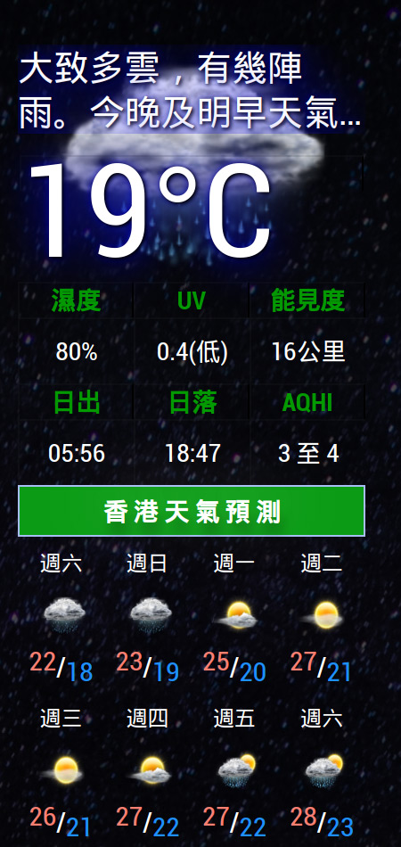
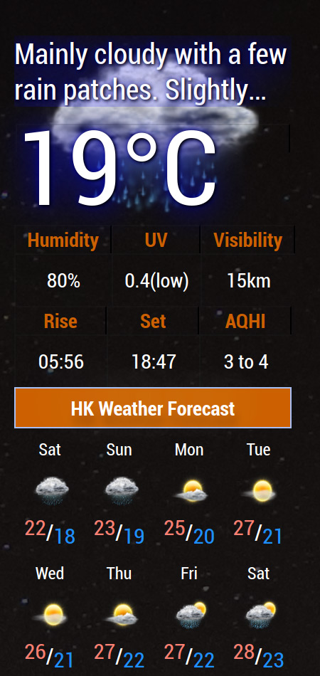

# MMM-HKWeather

**Weather from Hong Kong Observatory**

- Weather information is from Hong Kong Observatory.
- Air Quality Health Index ( AQHI ) data is from Environmental Protection Department.
- API can be found at [DATA.GOV.HK](https://data.gov.hk/tc/) , no API Key is needed.
- [VClouds Weather Icons by VClouds](https://www.deviantart.com/vclouds/art/VClouds-Weather-Icons-179152045).
- Appearance heavily inspired by [MMM-NOAA3 by cowboysdude](https://github.com/cowboysdude/MMM-NOAA3).


## Screenshots

 
 

## Installation
In your terminal, go to your MagicMirror's Module folder:
```javascript
cd ~/MagicMirror/modules/
```
Clone this repository:
```javascript
git clone https://github.com/aLECChe/MMM-HKWeather
```

## Config.js entry and options
- The lang option here is only used by the API.
- To change the interface language of the module, change the system language of MagicMirror.

```javascript
  		{
			module: "MMM-HKWeather",
			position: "top_left",
			config: {
				lang: "tc",  // API Language, en: english, tc: traditional chinese,  sc: simplified chinese
				updateInterval: 1000 * 60 * 60, // 60 minitues
			}
		},
```

## Updating

To update the module to the latest version:

In your terminal, go to MMM-HKWeather's folder:
```javascript
cd ~/MagicMirror/modules/MMM-HKWeather
```
Then type the following command:
```javascript
git pull
```` 

## License
[MIT](https://choosealicense.com/licenses/mit/)

## Enjoy!

